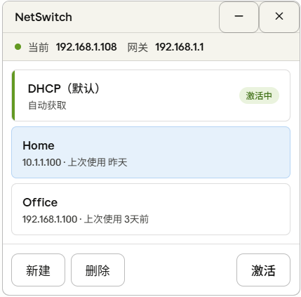

# NetSwitch

> Windows 系统托盘网络配置切换工具 — 多套 IP/网关/DNS 配置，一键切网。



## 这是什么

NetSwitch 是一个轻量级的 Windows 系统托盘工具，让你在多个网络配置方案之间一键切换，无需进入系统设置手动修改 IP、网关和 DNS。

**典型场景：**

- 每天带着笔记本往返家庭和公司，需要切换 DHCP / 静态 IP
- 调试软路由、自建 DNS 时频繁更换网关和 DNS 配置
- 客户现场网络与办公网络不同，需要快速切换

**系统要求：** Windows 10/11，需要管理员权限（修改网络配置必须提权）。

## 功能

### 核心体验
- **托盘常驻** — 最小化到系统托盘，不占任务栏空间，随时调用
- **多方案管理** — 新建、编辑、删除多套网络配置方案（DHCP 或静态 IP + 自定义 DNS）
- **右键秒切** — 托盘右键菜单直接选择方案，一键应用
- **网卡自动识别** — 每次切换自动检测系统当前优先网卡，无需手动选择

### 安全保障
- **切换安全** — 切换前自动备份当前配置，失败自动回滚，保证网络不中断
- **状态可视化** — 托盘图标颜色和 tooltip 实时反映网络状态

### 便捷特性
- **开机自启** — 可选开机启动，可选自动恢复上次使用的方案
- **检查更新** — 在设置里检查 GitHub Release 更新，支持下载并运行安装包，安装后启动新版
- **帮助与反馈** — 在设置里直达 GitHub 主页和 Issue 页面
- **首次友好** — 首次运行自动检测当前网络配置，如果是静态 IP 则自动导入为方案
- **单实例** — 重复启动时自动唤起已有窗口，不会启动多个实例
- **窗口位置记忆** — 主窗口关闭后再打开，自动恢复上次的位置

## 安装

### 安装包（推荐）

从 [Releases](https://github.com/MoeMoeGit/NetSwitch/releases) 下载 `NetSwitch-Setup-x.x.x.exe`，双击安装。

安装包功能：
- 自定义安装路径
- 可选桌面快捷方式
- 可选开机自启动

### 便携版

从 [Releases](https://github.com/MoeMoeGit/NetSwitch/releases) 下载 `NetSwitch.exe`，直接运行，无需安装。

> **注意**：修改网络配置需要管理员权限，启动时会弹出 UAC 提示。

## 使用

### 基本操作

| 操作 | 方式 |
|------|------|
| 切换方案 | 右键托盘图标 → 点击方案名称 |
| 打开主界面 | 左键单击托盘图标，或右键 → 打开主界面 |
| 新建方案 | 主界面 → 新建按钮 → 填写配置 → 保存 |
| 编辑方案 | 主界面 → 双击卡片，或右键卡片 → 查看详情 |
| 重命名方案 | 主界面 → 右键卡片 → 重命名 |
| 删除方案 | 主界面 → 选中卡片 → 删除按钮 |
| 打开设置 | 右键托盘图标 → 设置 |
| 退出程序 | 右键托盘图标 → 退出 |

### 键盘快捷键

主窗口打开时可用：

| 按键 | 功能 |
|------|------|
| Enter | 激活选中的方案 |
| Delete | 删除选中的方案（弹出确认） |
| F2 | 重命名选中的方案 |
| ESC | 取消选中，再按关闭窗口 |

### 方案配置说明

| 字段 | 说明 |
|------|------|
| 方案名称 | 任意名称，如"公司网络"、"家庭软路由" |
| IP 模式 | DHCP（自动获取）或手动指定 IP、掩码、网关 |
| 子网掩码 | 预设 /24、/16、/8，或自定义输入 |
| DNS 模式 | 自动获取，或手动指定首选/备用 DNS |

内置的「DHCP（默认）」方案不可删除、不可重命名，作为兜底方案始终可用。

### 托盘图标颜色

| 颜色 | 含义 |
|------|------|
| 深青色 | 正常 — 配置已应用，网关可达 |
| 橙黄色 | 警告 — 配置已应用，但网关不通或无网关 |
| 红色 | 错误 — 方案切换失败 |

鼠标悬停在托盘图标上可查看当前方案名称和状态详情。

### 设置

右键托盘图标 → 设置，可以配置：

- **开机自启** — 开机时自动启动 NetSwitch
- **开机恢复上次方案** — 启动时自动应用上次使用的网络方案
- **检查更新** — 查看最新 Release，并可下载安装到新版本
- **帮助与反馈** — 打开 GitHub 主页或 Issue 页面

所有方案数据保存在 `%AppData%\NetSwitch\profiles.json`。如需迁移到新电脑，直接复制该文件即可。

## 从源码构建

### 环境要求

- [Python](https://www.python.org/) 3.12
- [uv](https://docs.astral.sh/uv/) 包管理器

### 构建步骤

```bash
# 1. 克隆项目
git clone https://github.com/MoeMoeGit/NetSwitch.git
cd NetSwitch

# 2. 安装依赖
uv sync

# 3. 运行
uv run python main.py

# 4. 打包为 exe
uv run python scripts/generate_icon.py
uv run python scripts/build.py

# 5. 构建安装包（需要 Inno Setup 6）
iscc scripts/installer_output.iss
```

构建完成后，exe 在 `dist/NetSwitch.exe`，安装包在 `installer_output/` 目录。

## 技术栈

| 层级 | 技术 |
|------|------|
| 语言 | Python 3.12 |
| GUI | PyQt6 |
| 网络操作 | netsh（写入）+ PowerShell（读取） |
| 配置存储 | JSON 文件 |
| 打包分发 | PyInstaller + Inno Setup |

## 项目结构

```
NetSwitch/
├── main.py                 # 程序入口，单实例检测
├── tray.py                 # 系统托盘图标和菜单
├── main_window.py          # 主界面（卡片列表）
├── edit_dialog.py          # 方案编辑弹窗
├── settings_dialog.py      # 设置弹窗
├── profile_manager.py      # 方案增删改查
├── network_controller.py   # 网络配置读写、回滚
├── update_manager.py       # 更新检查和安装包下载
├── VERSION                 # 版本号
├── pyproject.toml          # 项目配置和依赖
├── assets/                 # 图标资源
└── scripts/                # 构建脚本和安装包模板
```

## 许可

Apache License 2.0
